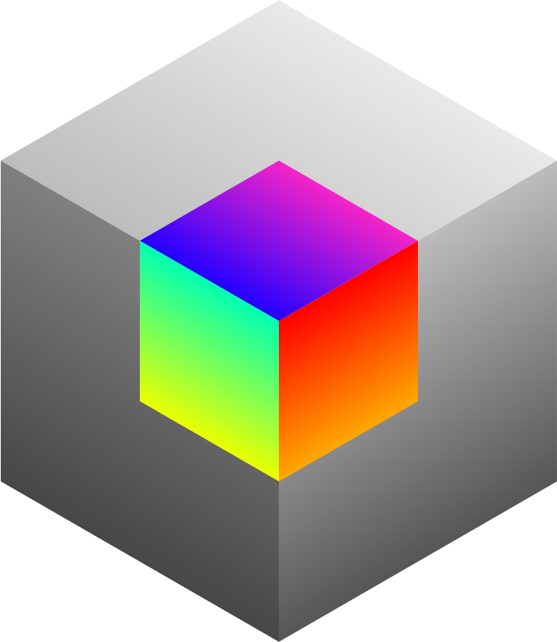
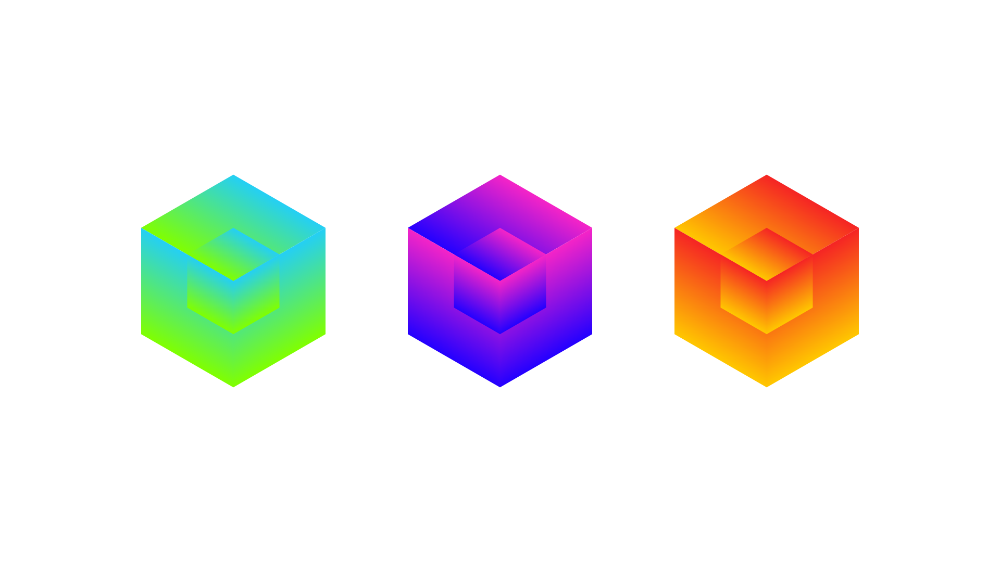

    

<h1 align="center">Latent Box (WIP!)</h1>

    A collection of awesome-lists for AI, creativity and art. AI、创意和艺术领域的精选合集。

  <samp>
    <a href="https://latentbox.com" target="_blank">latentbox.com</a> .
    <a href="https://twitter.com/latent_box" target="_blank">X</a> .
    <a href="https://discord.gg/V9CNuqYfte" target="_blank">Discord</a> .
    <a href="https://www.xiaohongshu.com/user/profile/660223ac000000000b00f2ce" target="_blank">小红书</a>
  </samp>

## Contributors

<!-- ALL-CONTRIBUTORS-LIST:START - Do not remove or modify this section -->
<!-- prettier-ignore-start -->
<!-- markdownlint-disable -->
<table>
  <tbody>
    <tr>
      <td align="center" valign="top" width="14.28%"><a href="https://troyni.com"> <b>Troy Ni</b></a></td>
      <td align="center" valign="top" width="14.28%"><a href="https://github.com/CPunisher"> <b>cpunisher</b></a></td>
      <td align="center" valign="top" width="14.28%"><a href="https://github.com/chenbaiyujason"> <b>shichen</b></a></td>
      <td align="center" valign="top" width="14.28%"><a href="https://github.com/zheishei"> <b>Chang</b></a></td>
      <td align="center" valign="top" width="14.28%"><a href="https://github.com/SuiyuanV"> <b>SuiyuanV</b></a></td>
      <td align="center" valign="top" width="14.28%"><a href="https://github.com/Zhaohan-Wang"> <b>Zhaohan Wang</b></a></td>
      <td align="center" valign="top" width="14.28%"><a href="https://github.com/jw782cn"> <b>chty627</b></a></td>
    </tr>
    <tr>
      <td align="center" valign="top" width="14.28%"><a href="https://github.com/LIUXIN52534"> <b>Stefano</b></a></td>
      <td align="center" valign="top" width="14.28%"><a href="https://github.com/HiMrHOW"> <b>MrHOW</b></a></td>
      <td align="center" valign="top" width="14.28%"><a href="https://chenmudw.zcool.com.cn"> <b>枯白子</b></a></td>
      <td align="center" valign="top" width="14.28%"><a href="https://github.com/gogodecay"> <b>JOJOZ</b></a></td>
      <td align="center" valign="top" width="14.28%"><a href="https://avantcontra.com"> <b>avantcontra</b></a></td>
      <td align="center" valign="top" width="14.28%"><a href="https://luosiallen.github.io"> <b>Simian Luo</b></a></td>
      <td align="center" valign="top" width="14.28%"><a href="http://haofanwang.github.io"> <b>Haofan Wang</b></a></td>
    </tr>
    <tr>
      <td align="center" valign="top" width="14.28%"><a href="https://github.com/op7418"> <b>op7418</b></a></td>
      <td align="center" valign="top" width="14.28%"><a href="https://github.com/onemachi"> <b>onemachi</b></a></td>
      <td align="center" valign="top" width="14.28%"><a href="https://github.com/ZHO-ZHO-ZHO"> <b>ZHO-ZHO-ZHO</b></a></td>
      <td align="center" valign="top" width="14.28%"><a href="https://antfu.me"> <b>Anthony Fu</b></a></td>
      <td align="center" valign="top" width="14.28%"><a href="https://jhuo.ca/"> <b>Ju Huo</b></a></td>
    </tr>
  </tbody>
</table>

<!-- markdownlint-restore -->
<!-- prettier-ignore-end -->

<!-- ALL-CONTRIBUTORS-LIST:END -->

## License

This work is licensed under a
[Creative Commons Attribution-NonCommercial-NoDerivs 4.0 International License][cc-by-nc-nd].

[![CC BY-NC-ND 4.0][cc-by-nc-nd-image]][cc-by-nc-nd]

[cc-by-nc-nd]: http://creativecommons.org/licenses/by-nc-nd/4.0/
[cc-by-nc-nd-image]: https://licensebuttons.net/l/by-nc-nd/4.0/88x31.png
[cc-by-nc-nd-shield]: https://img.shields.io/badge/License-CC%20BY--NC--ND%204.0-lightgrey.svg

